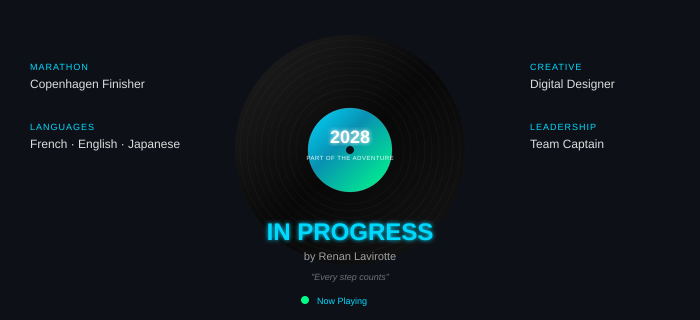
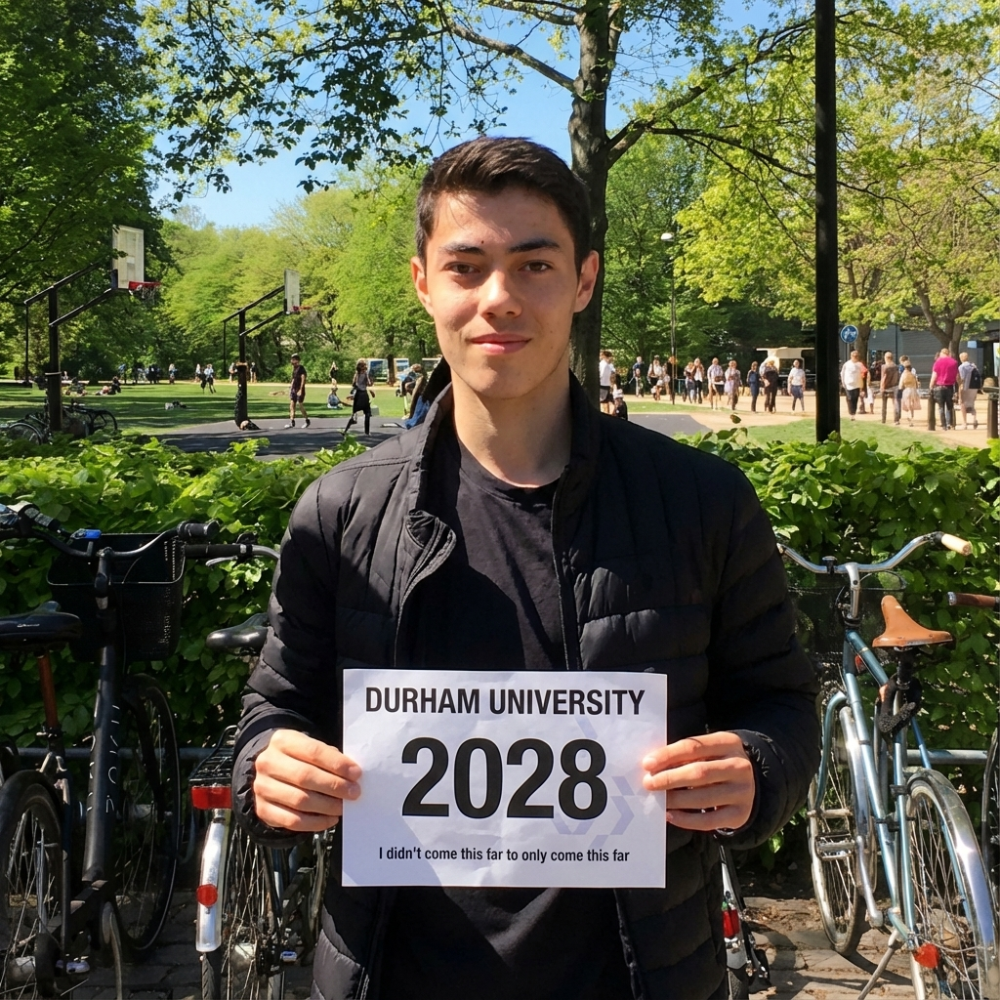

<!--
    Hey there! I'm Renan Lavirotte
    Welcome to my GitHub profile!
    
    Feel free to explore and connect with me on LinkedIn :)
-->

 

    

 

<!-- Animated Vinyl Record -->

    

 

---

## 🛠️ Tech Stack

### Main Skills

    
    
    
    
    
    

### Currently Exploring

---

## 🚀 Featured Projects

<table>
<tr>
<td width="50%">

### 🤖 VR AI Bot for IBM
Collaborative AI research with a 5-member team, implementing real-time adaptive interactions and IBM SkillsBuild AI modules for personalized learning experiences.

</td>
<td width="50%">

### 🛸 Mars Rover Memory Allocator
Fault-tolerant C systems for space robotics with automatic radiation-storm recovery detecting 100% of bit-flip corruptions.

</td>
</tr>
<tr>
<td width="50%">

### 👁️ Computer Vision Pipeline
90% accuracy gesture recognition system using OpenCV & MediaPipe for 3D spatial hand perception and pinch detection.

</td>
<td width="50%">

### 🚗 Autonomous Robot
Environment-reactive obstacle avoidance robot with 180° continuous scanning, 50+ systematic tests for perception optimization.

</td>
</tr>
</table>

---

## 🌍 Languages I Speak

| Language | Level | |
|:--------:|:-----:|:-:|
| French | Native | 🇫🇷 |
| English | Fluent | 🇬🇧 |
| Japanese | Intermediate | 🇯🇵 |

---

## 🏆 Sports & Leadership

    
    
    

 

> <!--*"Increased athlete engagement by 20% as captain at a top-2 UK sports university, competing in BUCS championships"*-->
> “Durham’s fastest sprinter and newly appointed men’s track captain.”
— The Palatinate, “The pinnacle of track and field: DUAXC take on BUCS Outdoors 2025”
https://www.palatinate.org.uk/the-pinnacle-of-track-and-field-duaxc-take-on-bucs-outdoors-2025/

---

## 📸 Life Beyond Code

    <h4>✨ I didn't come this far to only come this far ✨</h4>
    
     
    <b>🏃 Durham University Marathon to Success - 2028</b>

---
<!-- GitHub Stats 
## 📊 GitHub Stats

    
    

    

-->

---

## 🤝 Connect with Me!

    
    
    

---

## 💼 Employer?

> [!IMPORTANT]  
> <a href="https://github.com/Renanlvrt/Renanlvrt/raw/main/renan_lavirotte_cv.pdf">
> 
> </a>

---

    

<!--
    Thanks for visiting! Feel free to reach out 🚀
-->
